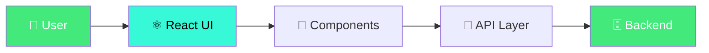

<div align="center">


<br/>


<br/><br/>


<br/>

  
  
  


&nbsp;&nbsp;[](LICENSE)&nbsp;&nbsp;[](https://github.com/anushkacodes70650/design-system/stargazers)

</div>

---

## 🚀 About

> **Published npm package with 40+ components, achieving 100% WCAG 2.1 AA compliance**

**Design System Library** is a production-ready **Frontend** project built with **React, TypeScript, Storybook, Tailwind CSS**.
Deployed on **Vercel** with full CI/CD pipeline.

---

## ⚡ Architecture



---

## 📊 Performance

<div align="center">

| Metric | Value |
|--------|-------|
| **Domain** | Frontend |
| **Stack** | React, TypeScript, Storybook, Tailwind CSS |
| **Platform** | Vercel |
| **Key Metric** | 40+ |
| **Performance** | 100% |
| **Scale** | 2 |

</div>

---

## 🛠️ Tech Stack

<div align="center">

&nbsp;&nbsp;&nbsp;&nbsp;

</div>

---

## 🚀 Quick Start

```bash
# 1. Clone
git clone https://github.com/anushkacodes70650/design-system.git
cd design-system

# 2. Install
npm install

# 3. Run
npm run dev
```

---

## 📂 Project Structure

```
design-system/
├── main.py (or src/)
├── requirements.txt / package.json
├── tests/
├── .github/workflows/ci.yml
├── .env.example
└── README.md
```

---

## 🤝 Contributing

1. Fork the repo
2. Create branch: `git checkout -b feature/your-feature`
3. Commit: `git commit -m 'Add your feature'`
4. Push: `git push origin feature/your-feature`
5. Open a Pull Request

---

## 📜 License

MIT License — free for commercial and personal use.

---

<div align="center">


### ⭐ Star this repo if it helped you!

[](https://github.com/anushkacodes70650)


</div>